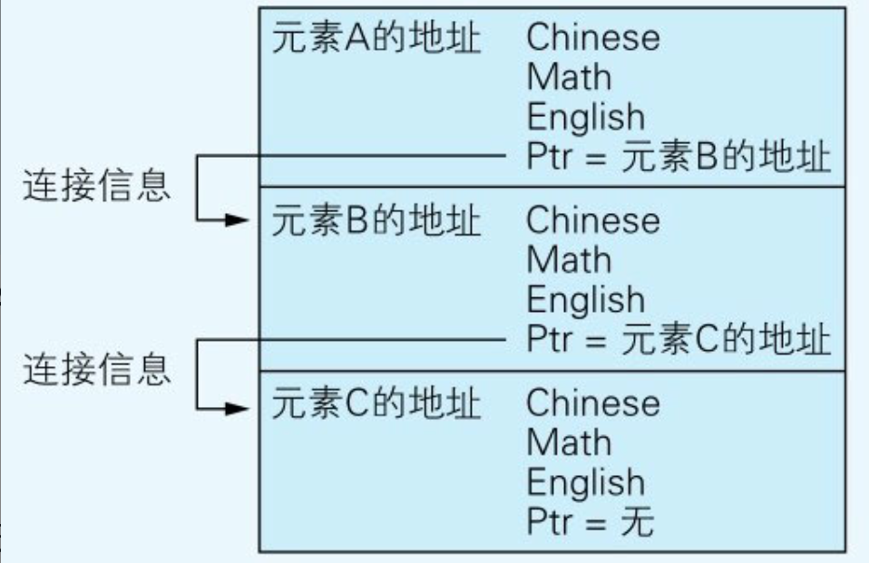
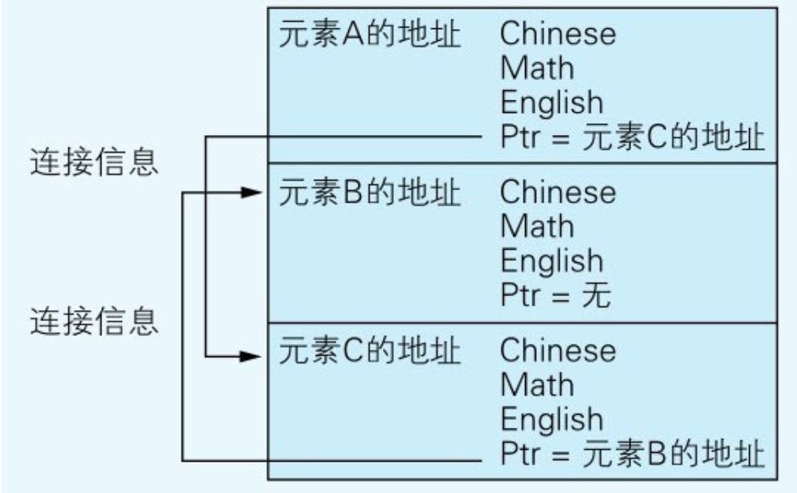
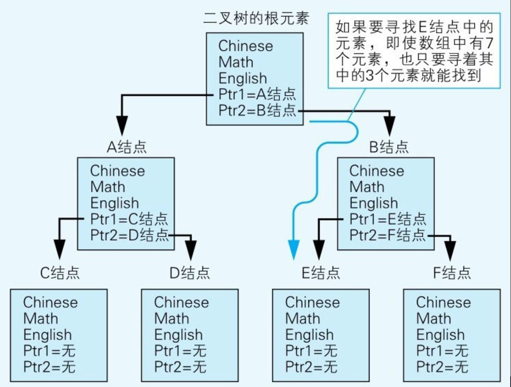

# 链表与二叉树

## 链表

```csharp
struct TestResult{
    char Chinese;
    char Math;
    char English;
    struct TestResult* Ptr; /* 指向其他元素的指针 */
}
```

这里的成员Ptr存储了数组中另一个元素的地址。

> C语言中，把存储着地址的变量称为“指针”​。

这种特殊的结构体可以称为“自我引用的结构体”，因为TestResult引用了与自身相同的数据类型。

<figure><figcaption><p>初始状态的链表中，元素的排列顺序与元素在内存上的物理排列顺序相同</p></figcaption></figure>

如果我们想改变元素的排列顺序（这里一个元素指的是一个结构体），**只要替换了Ptr的值，就可以对数组中的元素排序**，使元素的排列顺序不同于其在内存上的物理排列顺序。

<figure><figcaption><p>只要改变连接信息，元素就可以呈现出新顺序，不同于其在内存上的物理排列顺序</p></figcaption></figure>


链表的这个特性适用于对元素进行删除和插入，尤其是数据量大的时候。



## 二叉树

在二叉树的实现中，用的还是自我引用的结构体，只不过要改为要带有两个连接信息的成员的自我引用结构体。

```
struct TestResult{
    char Chinese;
    char Math;
    char English;
    struct TestResult* Ptr1; /* 指向其他元素的指针1 */
    struct TestResult* Ptr2; /* 指向其他元素的指针2 */
}
```

<figure><figcaption><p>如果使用了二叉树就能通过更短的路径发现目标数据</p></figcaption></figure>



无论是在哪种编程语言中，数据结构的基础都是数组，因此设法灵活地运用数组才是关键。



