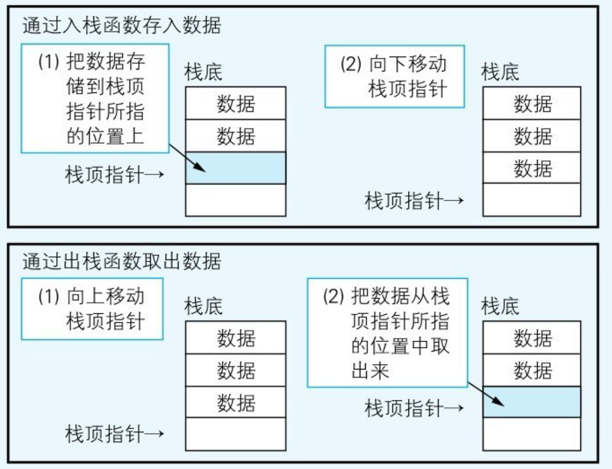
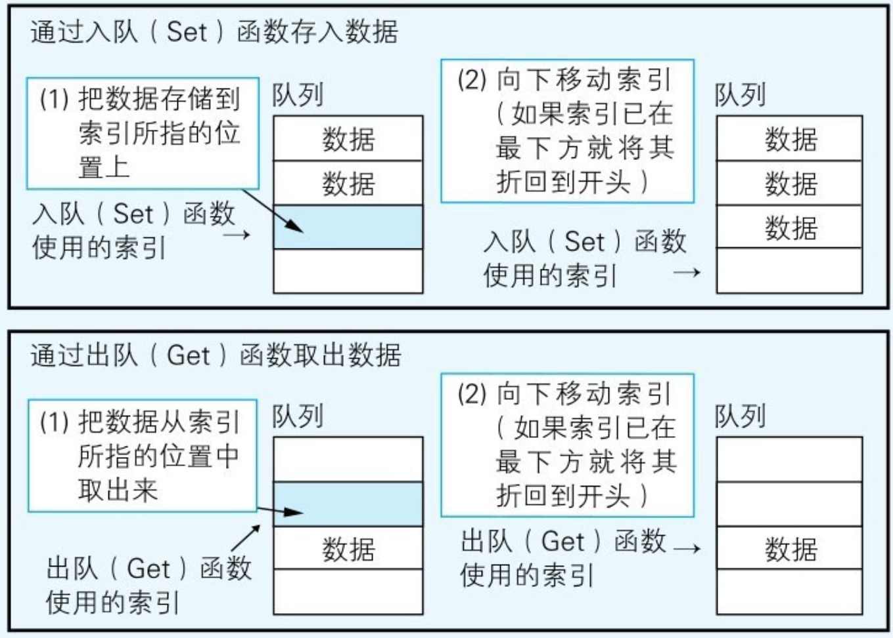

# 栈与队列

## 栈

实现这种数据结构，先定义一个变量和一个数组。该变量存储一个索引，**永远指向存储在栈中最顶端的数据**，被称为栈顶指针。

然后需要编写两个函数，规定入栈和出栈操作。两个函数都需要更新栈中所存储的**数据的总数**，以及**更新栈顶指针的位置**。

<figure><figcaption>
栈的存取
</figcaption></figure>

## 队列

* 一个数组
* 指向队头数据对应的索引的变量
* 指向队尾的数据对应的索引的变量
* 两个函数，数据存入和数据取出。


如果数据一直存放到了数组的末尾，那么下一个存储位置就会**折回到数组的开头**。这样就相当于数组的末尾就和它的开头连接上了，于是虽然数组的物理结构是“直线”​，但是其**逻辑结构已经变成“圆环”了**


<figure><figcaption>
队列的存取
</figcaption></figure>

