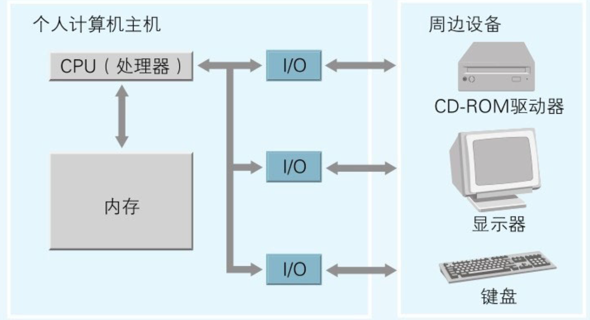

# 计算机组成

时钟

* CPU: 在其内部可对数据执行运算并控制内存和I/O
* 内存：存储指令和数据
* I/O：负责把键盘、鼠标、显示器等周边设备和主机连接在一起，实现数据的输入与输出。

<figure><figcaption>
计算机硬件的组成要素
</figcaption></figure>

只要用电路把CPU、内存以及I/O上的引脚相互连接起来，为每块IC提供电源，再为CPU提供时钟信号，硬件上的计算机就组装起来了。

时钟信号的作用

* **同步操作**： 时钟信号用于在不同硬件模块之间进行同步。计算机内部有多个元件，例如CPU、内存、I/O设备等，这些设备需要按照一定的节奏来传输数据和执行任务。时钟信号为这些模块提供一个统一的节拍，使它们可以协调一致地工作。每个周期的时钟脉冲意味着所有相关电路和组件都“知道”什么时候可以进行下一步操作，例如传输数据或执行指令。

<!---->

* **控制数据流**： CPU内部的各个模块（如算术逻辑单元、寄存器等）在执行指令的过程中也需要时钟信号来控制操作的顺序。例如，一个加法运算通常会分为取数、运算、存储结果等多个步骤，每一步操作都需要通过时钟信号进行协调和控制。

<!---->

* **速度决定因素**： 时钟信号的频率也决定了CPU和整个计算机系统的运行速度。时钟频率越高，意味着CPU每秒钟可以进行的操作周期越多，从而能够执行更多的指令。现代计算机中的CPU，时钟频率通常在几GHz的范围。例如，2 GHz的频率意味着CPU每秒钟执行20亿个操作周期。

