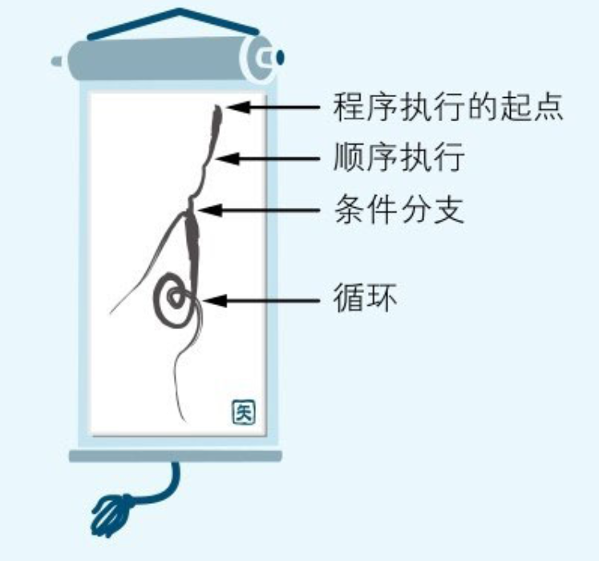

# 程序像河水一样流动

把程序流动程序员一般都是先考虑程序的流程再开始编写程序的。

**作为计算机大脑的CPU在同一时刻基本上只能够解释、执行一条指令**。把指令和作为指令操作对象的数据排列起来就形成了程序。请想象把若干条指令一条挨一条地依次排列到一条长长的纸带上。然后把这条纸带展开抻平，从顶端开始依次解释并执行上面的每条指令，这样看起来程序就好像流动起来了。

 将河水流动比作程序流动

程序的流程也分为三种。在程序中：

* 把犹如水流向着一个方向流淌的流程称作“顺序执行”​；
* 把犹如水流流着流着产生了支流的流程称作“条件分支”​；
* 把犹如水流卷成漩涡的流程称作“循环”​。

## 程序流程就是顺序、循环、条件的组合

假设PC寄存器正指向内存中一个从10号地址开始的3字节指令。CPU解释执行完这条指令后，PC寄存器中的值就变成10+3=13了。下图显示了这个顺序执行的示意图。

<figure><figcaption>
硬件上的程序流程（顺序执行）
</figcaption></figure>

* 顺序执行是按照指令记录在内存中的先后顺序依次执行的一种流程；
* 循环则是在程序的特定范围内反复执行若干次的一种流程；
* 条件分支是根据若干个条件的成立与否，在程序的流程中产生若干个分支的一种流程。

**无论规模多么大多么复杂的程序，都是通过把以上三种流程组合起来实现的。**

## 使用流程图来构建你的程序

<figure><figcaption>
最低限度所需的流程图符号
</figcaption></figure>

## 画流程图来思考算法

算法(Algorithm)，就是解决既定问题的步骤。

思考算法时的要点是要分两步走，先从整体上考虑程序的粗略流程，再考虑程序各个部分细节的流程。

几乎所有的程序从整体来看都具有一个一成不变的流程，那就是**“**<mark style="color:red;">**初始化处理”→“循环处理”→“收尾处理**</mark>**“**

## 特殊的程序流程——中断处理

中断处理是指计算机使程序的流程突然跳转到程序中的特定地方，这样的地方被称为中断处理例程(Routine)或是中断处理程序(Handler)。

中断处理以从硬件发出的请求为条件，使程序的流程产生分支，因此可以说它是一种特殊的条件分支。

处理中断请求的程序，或是内置于被烧录在计算机ROM中的**BIOS系统**（Basic Input Output System，基本输入输出系统）中，或是内置于**Windows等操作系统**中。

## 特殊的程序流程——事件驱动

**把事件驱动想象成是两个程序在对话**

在程序中有WinMain()和WndProc()两个函数（代码块）​。

* WinMain()是在程序启动时被调用的主例程(Main Routine)
* WndProc()用于事件发生时通知应用程序开始后续处理

> 通常把用户在应用程序中点击鼠标或者敲击键盘这样的操作称作“事件”(Event)

Windows系统是WndProc()的调用者。Windows通过调用应用程序的WndProc()函数通知应用程序事件的发生。而**应用程序则根据事件的类型做出相应的处理**。这种机制就是事件驱动。可以被看作是一种特殊的条件分支流程。


用流程图表示事件驱动有点复杂，通常用[状态转化图](bu-chong-nei-rong/zhuang-tai-zhuan-hua-tu.md)来可视化事件驱动的流程。


